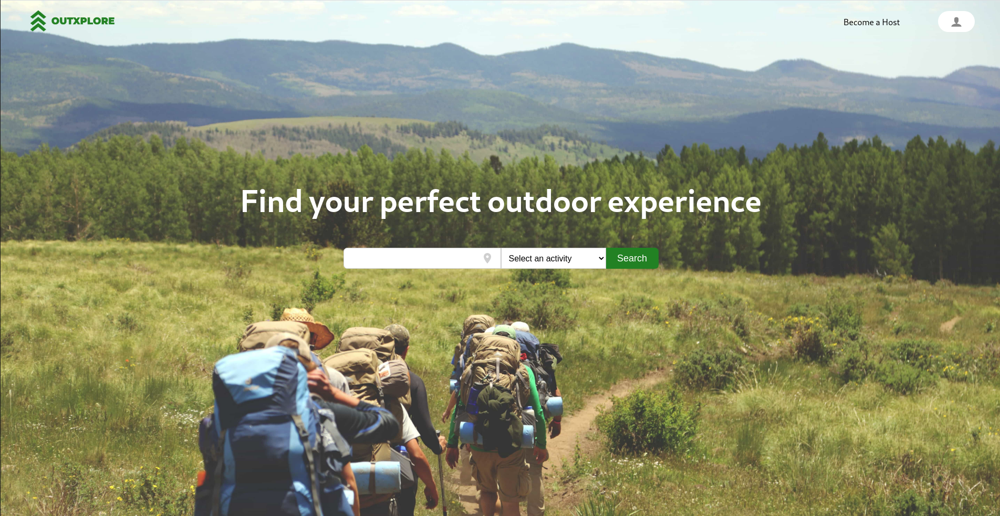
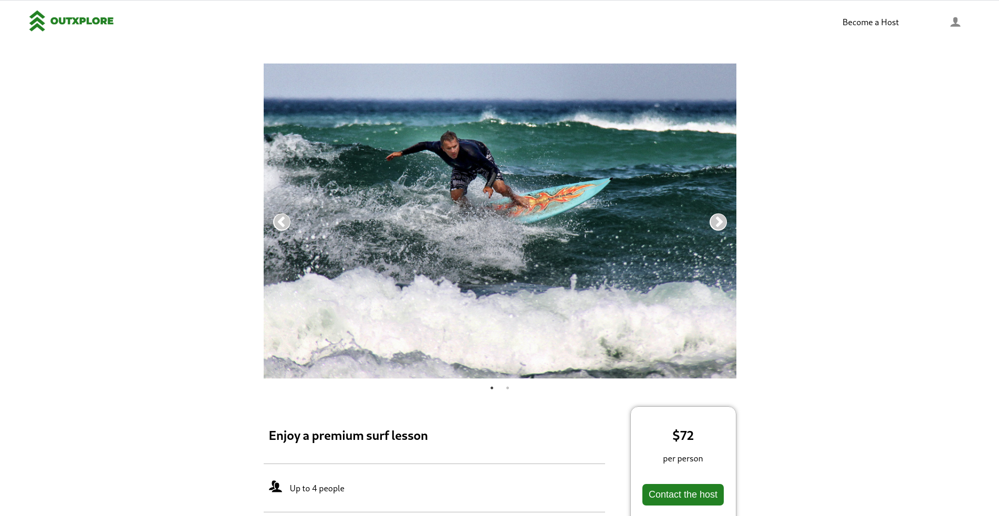

<p align="center">
  
</p>

> Find your perfect outdoor experience

## Table of Contents

* [About the Project](#about-the-project)
  * [Built With](#built-with)
* [Setup](#setup)
* [Author](#author)
* [Show your Support](#show-your-support)
* [Acknowledgements](#acknowledgements)

<!-- ABOUT THE PROJECT -->
## About The Project

### Home

<p align="center">
  
</p>

### Listing Details Page

<p align="center">
  
</p>

The app is an MVP of an online Peer-to-Peer marketplace, for hosting outdoor activities.

At the moment Users can browse through the listings, sign up / log in, update their profile photo, and apply to become a host.

Approved hosts can do all of the above plus create their own listings.

To become a host Users need to fill out the 'Become a host' form. After that, they will receive an email letting them know that their application was successful. And then, the Outxplore team reviews the application and notifies the User accordingly.

Once a User is approved they can then create their own listings.

### To do in the future

- Host contact information
- Wishlist
- Listing search
- Testing
- Do you have any ideas?

#### The frontend of the app is built with React and Redux, and the backend is an API built with Ruby on Rails

Link to the Backend repository: [Outxplore API](https://github.com/ermin-cahtarevic/outxplore-api)

Live version of the project: [Outxplore](https://outxplore.com)

Project Link: [Outxplore App](https://github.com/ermin-cahtarevic/outxplore)


### Built With

*   `React`
*   `Redux`
*   `react-slick` - [React Slick](https://react-slick.neostack.com/)
*   `react-loader-spinner` - [react-loader-spinner](https://www.npmjs.com/package/react-loader-spinner)
*   `react-icons` - [React Icons](https://react-icons.github.io/react-icons/)
*   `npm`
*   `CSS`
*   `ES6`

## Setup

```
git clone git@github.com:ermin-cahtarevic/outxplore.git
```
### Install dependencies

```
npm install
```

### Start Development Server

```
npm start
```
### Visit this link in your browser
```
http://localhost:3000/
```

### Run ESlint

```
npx eslint .
```
### Run Stylelint

```
npx stylelint "**/*.{css,scss}"
```

### Tests

A feature that I plan to implement in the future.

<!-- CONTACT -->
## Author

- Personal website: [ermin.dev](https://ermin.dev)
- Github: [@ermin-cahtarevic](https://github.com/ermin-cahtarevic)
- Twitter: [@ErminCahtarevic](https://twitter.com/ErminCahtarevic)
- Linkedin: [Ermin Cahtarevic](https://www.linkedin.com/in/ermincahtarevic/)

<!-- ABOUT THE PROJECT-->
## Show your support

Give a star if you like this project!

<!-- ACKNOWLEDGEMENTS -->
## Acknowledgements

* [Microverse](https://www.microverse.org/)
* All of the images used for the project can be found on [Unsplash](https://unsplash.com/)